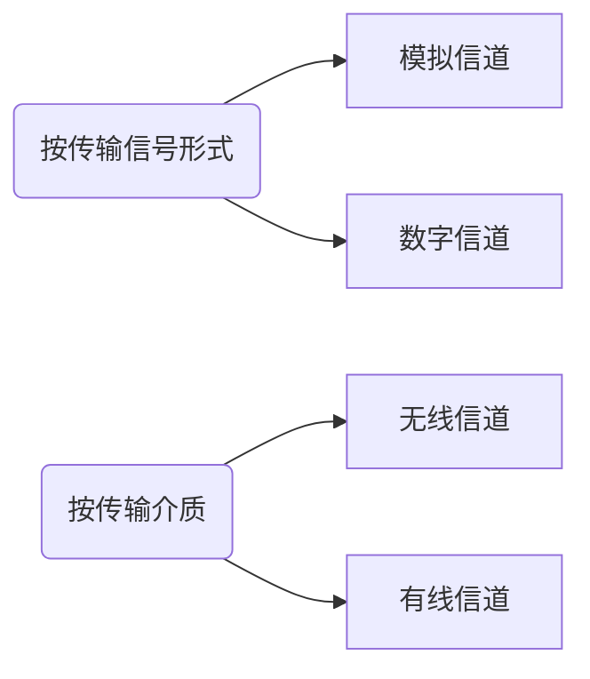

# 第1章 计算机网络体系结构

> - 计算机网络概述
>   - 计算机网络的概念、组成、功能、分类
>   - 计算机网络的性能指标
> - 计算机网络体系结构与参考模型
>   - 计算机网络分层结构，计算机网络协议、接口、服务的概念
>   - ISO/OSI参考模型和TCP/IP模型

## 1.1 计算机网络概述

### 1.1.1 计算机网络的概念

计算机网络是一个将分散的、具有独立功能的计算机系统，通过通信设备与线路连接起来，由功能完善的软件实现资源共享和信息传递的系统。简而言之——一些互联的、自治的计算机系统的集合

#### 1. 广义观点

- 只要是能实现远程信息处理的系统或能进一步达到资源共享的系统，都是计算机网络

- 广义观点定义了一个计算机通信网络，它在物理上具有计算机网络的雏形，但资源共享能力弱，是计算机网络发展的低级阶段

#### 2. 资源共享观点

- 以能够相互共享资源的方式互连起来的自治计算机系统的集合
  - 目的——资源共享
  - 组成单元——分布在不同地理位置的多台独立的“自治计算机”
  - 网络中的计算机必须遵循的统一规则——网络协议

- 该定义符合目前计算机网络的基本特征

#### 3. 用户透明性观点

存在一个能为用户自动管理资源的网络操作系统，它能够调用用户所需要的资源，而整个网络就像一个大的计算机系统一样对用户是透明的。用户使用网络就像使用一台单一的超级计算机，无须了解网络的存在、资源的位置信息

用户透明性观点定义描述了一个分布式系统，它是网络未来发展追求的目标

### 1.1.2 计算机网络的组成

- 从组成部分上看：
  - 硬件。主要由主机、通信链路、交换设备和通信处理机等组成
  - 软件。主要包括各种实现资源共享的软件和方便用户使用的各种工具软件，软件部分多属于应用层
  - 协议。计算机网络的核心，规定了网络传输数据时所遵循的规范
- 从工作方式上看：
  - 边缘部分。由所有连接到因特网上、供用户直接使用的主机组成，用来进行通信和资源共享
  - 核心部分。由大量的网络和连接这些网络的路由器组成，它为边缘部分提供连通性和交换服务

- 从功能组成上看：
  - 通信子网。由各种传输介质、通信设备和相应的网络协议组成，它使网络具有数据传输、交换、控制和存储的能力，实现联网计算机之间的数据通信
  - 资源子网。是实现资源共享功能的设备及其软件的集合，向网络用户提供共享其他计算机上的硬件资源、软件资源和是数据资源的服务

### 1.1.3 计算机网络的功能

#### 1. 数据通信

#### 2. 资源共享

#### 3. 分布式处理

#### 4. 提高可靠性

#### 5. 负载均衡

### 1.1.4 计算机网络的分类

#### 1. 按分布范围

- 广域网
- 城域网
- 局域网
- 个人区域网

#### 2. 按传输技术

- 广播式网络

- 点对点网络

#### 3. 按拓扑结构

- 总线形
- 星形
- 环形
- 网状

#### 4. 按使用者

- 公用网

- 专用网

#### 5. 按交换技术

- 电路交换网络
- 报文交换网络
- 分组交换网络

#### 6. 按传输介质

- 有线网络
  - 双绞线网络
  - 同轴电缆网络
- 无线网络
  - 蓝牙
  - 微波
  - 无线电

### 1.1.5 计算机网络的标准化工作

因特网的所有标准都以RFC（Request For Comments）的形式在因特网上发布，但并非每个RFC都是因特网标准，RFC要上升为因特网的正式标准需经过：

1. 因特网草案Internet Draft.这个阶段还不是RFC文档
2. 建议标准Proposed Standaard.从这个阶段开始就成为RFC文档
3. 草案标准Draft Standard
4. 因特网标准Internet Standard

在国际上，负责制定、实施相关网络标准的标准化组织众多，主要有：

- 国际标准化组织ISO
- 国际电信联盟ITU
- 国际电气电子工程师协会IEEE

### 1.1.6 计算机网络的性能指标

- 带宽Bandwidth
- 时延Delay
  - 发送时延
  - 传播时延
  - 处理时延
  - 排队时延
- 时延带宽积
- 往返时延Round-Trip Time,RTT
- 吞吐量Throughput
- 速率Speed
- 信道利用率

## 1.2 计算机网络体系结构与参考模型

### 1.2.1 计算机网络分层结构

分层的基本原则：

- 每层都实现一种相对独立的功能，降低大系统的复杂度
- 各层之间界面自然清晰，易于理解，相互交流尽可能少
- 各层功能的精确定义独立于具体的实现方法，可以采用最合适的技术来实现
- 保持下层对上层的独立性，上层单向使用下层提供的服务
- 整个分层结构应能促进标准化工作

> 实体：任何可发送或接收信息的硬件或软件进程，通常是一个特定的软件模块
>
> 服务数据单元SDU：为完成用户所要求的功能而应传送的数据
>
> 协议控制信息PCI：控制协议操作的信息
>
> 协议数据单元PDU：对等层次之间传送的数据单位称为该层的PDU（物理层的PDU称为比特，数据链路层的PDU称为帧，网络层的PDU称为分组，传输层的PDU称为报文段）

具体地，层次结构的含义包括一下几个方面：

1. 第n层的实体不仅要使用第n - 1层的服务来实现自身定义的功能，还要向第n + 1层提供本层的服务，该服务是第n层及其下面各层提供的服务总和
2. 最底层只提供服务，是整个层次结构的基础；中间各层既是下一层的服务使用者，又是上一层的服务提供者；最高层面向用户提供服务
3. 上一层只能通过相邻层间的接口使用下一层的服务，而不能调用其他层的服务；下一层所提供服务的实现细节对上一层透明
4. 两台主机通信时，对等层在逻辑上有一条直接信道，表现为不经过下层就把信息传送到对方

### 1.2.2 计算机网络协议、接口、服务的概念

#### 1. 协议

协议由语法、语义和同步三部分组成

- 语法规定了传输数据的格式
- 语义规定了所要完成的功能
- 同步规定了执行各种操作的条件、时序关系等

一个完整的协议通常应具有线路管理、差错控制、数据转换等功能

#### 2. 接口

同一结点内相邻两层间交换信息的连接点，是一个系统内部的规定

- 每层只能为紧邻的层次之间定义接口，不能跨层定义
- 典型接口上，同一结点相邻两层的实体通过服务访问点（Service Access Point,SAP）进行交互

#### 3. 服务

上层使用下层所提供的服务时必须与下层交换一些命令，这些命令在OSI参看模型中称为服务原语。其分为4类：

- 请求Request
- 指示Indication
- 响应Response
- 证实Confirmation

计算机网络提供的服务可按以下分类：

- 面向连接服务与无连接服务
- 可靠服务和不可靠服务
- 有应答服务和无应答服务

> 在一层内完成的全部功能并非都称为服务，只有能够被高一层实体“看得见”的功能才能称为服务

### 1.2.3 ISO/OSI参考模型和TCP/IP模型

#### 1. OSI参考模型

开发系统互连参考模型：

##### a> 物理层 Physical Layer

传输单位是比特，功能是在物理媒体上为数据端设备透明地传输原始比特流

物理层主要研究以下内容：

- 通信链路与通信结点的连接需要一些电路接口，物理层规定了这些接口的一些参数
- 规定通信链路上传输的信号的意义和电气特征

##### b> 数据链路层 Data Link Layer

传输单位是帧，任务是将网络层传来的IP数据报组装成帧。功能可以概括为成帧、差错控制、流量控制和传输管理等

典型的数据链路层协议有SDLC、HDLC、PPP、STP和帧中继等

##### c> 网络层 Network Layer

传输单位是数据报，主要任务是把网络层的协议数据单元（分组）从源端传到目的端，为分组交换网上的不同主机提供通信服务。关键问题是对分组进行路由选择、并实现流量控制、拥塞控制、差错控制和网际互联等功能

网络层的协议有IP、IPX、ICMP、IGMP、ARP、RARP和OSPF等

##### d> 传输层 Transport Layer

传输单位是报文段（TCP）或用户数据报（UDP），负责主机中两个进程之间的通信，功能是为端到端连接提供可靠的传输服务，为端到端连接提供流量控制、差错控制、服务质量、数据传输管理等服务

数据链路层提供的是点到点的通信，传输层提供的是端到端的通信。通俗理解：点到点可以理解为主机与主机，端到端是指运行在不同主机内的两个进程之间

传输层协议有TCP、UDP

##### e> 会话层 Session Layer

负责管理主机间的会话进程，包括建立、管理和终止进程间的会话。可以使用校验点使通信失效时从校验点继续恢复通信，实现数据同步

##### f> 表示层 Presentation Layer

主要处理在两个通信系统中交换信息的表示方式，数据压缩、加密和解密也是表示层可提供的数据表示变换功能

##### g> 应用层 Application Layer

为特定类型的网络应用提供访问OSI参考模型环境的手段

#### 2. TCP/IP模型

##### a> 网络接口层

从主机或结点接收IP分组，并把它们发送到指定的物理网络上

##### b> 网际层

将分组发往任何网络，并为之独立地选择合适的路由，但不保证各个分组有序地到达，各个分组的有序交付由高层负责。网际层定义了标准的分组格式和协议，即IP

##### c> 传输层

发送端和目的端主机上的对等实体进行会话

##### d> 应用层

#### 3. TCP/IP模型与OSI参考模型的比较

相同点：

- 都采取分层的体系结构，将庞大复杂的问题划分为若干较容易处理的、范围较小的问题，而且分层的功能也大体相似
- 二者都是基于独立的协议栈的概念
- 二者都可以解决异构网络的互连，实现世界上不同厂家生产的计算机之间的通信

不同点：

- OSI参考模型的最大贡献就是精确地定义了三个主要概念：服务、协议和接口，这与现代的面向对象程序设计思想非常吻合。而TCP/IP模型在这三个概念上却没有明确区分
- OSI产生在协议发明之前，没有偏向于任何特定的协议，通用性良好。但设计者在协议方面没有太多经验，不知道把哪些功能放到哪一层更好。TCP/IP模型正好相反

- TCP/IP模型在设计之初就考虑到了多种异构网的互连问题，并将网际协议（IP）作为一个单独的层次
- OSI参考模型在网络层支持无连接和面向连接的通信，但在传输层仅有面向连接的通信。而TCP/IP模型认为可靠性是端到端的问题，因此它在网际层仅有一种无连接的通信模式，但传输层支持无连接和面向连接两种模式

# 第2章 物理层

> - 通信基础
>
>   - 信道、信号、带宽、码元、波特、速率、信源与信宿等基本概念
>   - 奈奎斯特定理与香农定理，编码与调制
>   - 电路交换、报文交换与分组交换，数据包与虚电路
>
> - 传输介质
>
>   双绞线、同轴电缆、光纤与无线传输介质，物理层接口的特性
>
> - 物理层设备
>
>   - 中继器，集线器

## 2.1 通信基础

### 2.1.1 基本概念

#### 1. 数据、信号与码元

- 数据是指传送信息的实体
- 信号是数据的电气或电磁表现
  - 连续变化的数据（或信号）称为模拟数据（或模拟信号）
  - 取值仅允许为有限的几个离散数值的数据（或信号）称为数字数据（或数字信号）
- 码元是指用一个固定时长的信号波形（数字脉冲）表示一位k进制数字
  - 代表不同离散数值的基本波形
  - 是数字通信中数字信号的计量单位
  - 这个时长内的信号称为k进制码元，而该时长称为码元宽度

#### 2. 信源、信道与信宿

- 信源是产生和发送数据的源头
- 信宿是接收数据的终点
  - 发送端信源发出的信息需要通过变换器转换成适合于在信道上传输的的信号，而通过信道传输到接收端的信号先由反变换器转换成原始信息，再发送给信宿
- 信道与电路并不等同，信道是信号的传输媒介

信道上传送的信号分为：

- 基带信号。在数字信道上传输（称为基带传输）
- 宽带信号。在模拟信道上传输（称为宽带传输）

从通信双方信息的交互方式看，可分为三种基本方式：

1. 单向通信
2. 半双工通信。双方都可发送或接收信息，但任意一方不能同时发送和接收
3. 全双工通信。通信双方可以同时发送和接收消息

信道的极限容量是指信道的最高码元传输速率或信道的极限信息传输速率

#### 3. 速率、波特与带宽

- 速率指数据传输速率，表示单位时间内传输的数据量，可以用码元传输速率和信息传输速率表示：
  - 码元传输速率。又称波特率，表示单位时间内数字通信系统所传输的码元个数，单位是波特（Baud）。码元速率与进制数无关
  - 信息传输速率。又称信息速率、比特率等，表示单位时间内数字通信系统传输的二进制码元个数（即比特数），单位是比特/秒（b/s）

- 带宽原指信号具有的频带宽度，单位是赫兹（Hz）
  - 带宽与数据率存在数值上的互换关系，因此常用来表示网络的通信线路所能传输数据的能力
  - 因此，带宽表示单位时间内从网络中的某一点到另一点所能通过的“最高数据率”，此时单位是b/s

### 2.1.2 奈奎斯特定理与香农定理

#### 1. 奈奎斯特定理

> 信号中的许多高频分量往往不能通过信道，否则在传输中会衰减，导致接收端收到的信号波形失去码元之间的清晰界限，这种现象称为码间串扰

在理想低通（没有噪声、宽带有限）的信道中，为了避免码间串扰，极限码元传输速率为2W波特，其中W是理想低通信道的带宽。若用V表示每个码元离散电平的数目，则极限数据率为
$$
理想低通信道下的极限数据传输速率 = 2Wlog_2V（单位为b/s）
$$
对于奈氏准则，可以得出：

1. 在任何信道中，码元传输速率是有上限的。如果超出，会出现严重的码间串扰问题，使得接收端不可能完全正确识别码元
2. 信道的频带越宽（即通过的信号高频分量越多），就可用更高的速率进行码元的有效传输
3. 奈氏准则给出了码元传输速率的限制，但并未对信息传输速率给出限制，即未对一个码元可以对应多少个二进制位给出限制

由于码元传输速率受奈氏准则制约，所以要提高数据传输速率，就必须使每个码元携带更多比特的信息量，此时需要采用多元制的调制方法

#### 2. 香农定理

Shannon定理给出了带宽受限且有高斯白噪声干扰的信道的极限数据传输速率，当用此速率进行传输时，可以做到不产生误差，香农定理定义为：
$$
信道的极限数据传输速率 = Wlog_2(1 + S / N)（单位为b/s）
$$
其中，W为信道的带宽，S为信道所传输信号的平均功率，N为信道内部的高斯噪声功率。S/N为信噪比，即信号的平均功率与噪声的平均功率之比，信噪比 = 10log~10~(S/N)（单位为dB）

对于香农定理，可以得出：

1. 信道的带宽或信道中的信噪比越大，信息的极限传输速率越高
2. 对一定的传输带宽和一定的信噪比，信息传输速率的上限是确定的
3. 只要信息传输速率低于信道的极限传输速率，就能找到某种方法来实现无差错的传输
4. Shannon定理得出的是极限信息传输速率，实际信道能达到的传输速率要比它低不少

> 奈氏准则只考虑了带宽与极限码元传输速率的关系，而香农定理不仅考虑到了带宽，也考虑了信噪比。这从另一个侧面表明，一个码元对应的二进制位数是有限的

### 2.1.3 编码与调制

- 把数据变化成模拟信号的过程称为调制
- 把数据变换为数字信号的过程称为编码

#### 1. 数字数据编码为数字信号

数字数据编码用于基带传输中，即在基本不改变数字数据信号频率的情况下，直接传输数字信号，常用的数字数据编码有：

- 归零编码 RZ 高电平代表1、低电平代表0（或者相反），每个时钟周期的中间均跳到低电平，接收方根据该跳变调整本方的时钟基准，这就为传输双方提供了自同步机制。由于归零需要占用一定带宽，因此传输速率受到了一定影响
- 非归零编码 NRZ 无法传递时钟信号，双方难以同步，因此若要高速同步数据，则需要都带有时钟线
- 反向非归零编码 NRZI 用信号的翻转代表0、保持不变代表1.翻转的信号本身可以作为一种通知机制。这种编码方式集成了前两种的优点，既能传输时钟信号，又能尽量不损失系统带宽。USB2.0通信的编码方式就是NRZI
- 曼彻斯特编码 将一个码元分成两个相等的间隔，前一个间隔为高电平而后一个为低电平表示码元1；反之表示码元0.该编码的特点是，在每个码元的中间出现电平跳变，位中间的跳变既作为时钟信号，又作为数据信号，但它所占的频带宽度是原始基带宽度的两倍。以太网使用的编码方式
- 差分曼彻斯特编码 常用于局域网传输。规则为：若码元为1,则前半个码元的电平与上一个码元的后半个的电平相同；若码元为0,则情形相反。特点是，在每个码元的中间都有一次电平的跳转，可以实现自同步，且抗干扰性较好
- 4B/5B编码 

#### 2. 数字数据调制为模拟信号

基本的数字调制方法有：

- 幅移键控（ASK）通过改变载波信号的振幅来表示数字信号1和0,而载波的频率和相位不变。比较容易实现，但抗干扰能力差

- 频移键控（FSK）通过改变载波信号的频率来表示数字信号1和0,而载波的振幅和相位不变。容易实现，抗干扰能力强，目前应用较为广泛

- 相移键控（PSK）通过改变载波信号的相位来表示数字信号1和0,而载波的频率和振幅不变。又分为绝对调相和相对调相

- 正交振幅调制（QAM）在频率相同的前提下，将ASK和PSK结合起来，形成叠加信号。设波特率为B,采用m个相位，每个相位有n中振幅，则该QAM技术的数据传输速率R为
  $$
  R = Blog_2(mn)（单位为b/s）
  $$

#### 3. 模拟数据编码为数字信号

最典型的例子是常用于对音频信号进行编码的脉码调制（PCM）。主要包括三个步骤，即采样、量化和编码

采样定理：采样频率必须大于等于最大频率的两倍，才能保证采样后的数字信号完整的保留原始模拟信号的信息（采样定理又称奈奎斯特定理）

- 采样是指对模拟信号进行周期性扫描，把时间上连续的信号变成时间上离散的信号，根据采样定理，当采样的频率大于等于模拟数据的频带带宽两倍时，所得的离散信号可以无失真地代表被采样的模拟数据
- 量化是把采样取得的电平幅值按一定的分级标度转化为对应的数字值并取整数，这样就把连续的电平幅值转换为离散的数字量。采样和量化的实质就是分割和转换
- 编码是把量化的结果转换为与之对应的二进制编码

#### 4. 模拟数据调制为模拟信号

可以使用频分复用（FDM），充分利用带宽资源。电话机和本地局交换机采用模拟信号传输模拟数据的编码方式，模拟的声音数据是加载到模拟的载波信号中传输的

### 2.1.4 电路交换、报文交换和分组交换

#### 1. 电路交换

- 两个结点之间必须先建立一条专用的物理通信路径
- 路径可能经过许多中间结点
- 路径在数据传输期间被独占，通信结束后才释放

电路交换分为三个阶段：连接建立、数据传输和连接释放。关键点是，在数据传输的过程中，用户始终占用端到端的固定传输带宽

优点如下：

- 通信时延小
- 有序传输
- 没有冲突
- 适用范围广
- 实时性强
- 控制简单

缺点：

- 建立连接时间长
- 线路独占
- 灵活性差
- 难以规格化

#### 2. 报文交换

报文携带有目标地址、源地址等信息。报文交换在交换结点采用的是存储转发的传输方式，优点如下：

- 无须建立连接
- 动态分配线路
- 提高线路可靠性
- 提高线路利用率
- 提供多目标服务

缺点：

- 由于数据进入交换结点后要经历存储、转发这一过程，因此会引起转发时延
- 报文交换对报文的大小没有限制，这就要求网络结点需要有较大的缓存空间

#### 3. 分组交换

分组交换限制了每次传送的数据块大小的上限，再加上一些必要的控制信息（如源地址、目的地址和编号信息等）构成分组（Packet）。网络结点根据控制信息把分组送到下一个结点，下一个结点接收到分组后，暂存并排队等待传输，然后根据分组控制信息选择它的下一结点，直到到达目的结点。优点如下：

- 无建立时延
- 线路利用率高
- 简化了存储管理
- 加速传输
- 减少了出错概率和重发数据量

缺点：

- 存在存储转发时延
- 需要传输额外的信息量
- 当分组交换采用数据报服务时，可能会出现失序、丢失或重复分组

### 2.1.5 数据报与虚电路

分组交换根据其通信子网向端点系统提供的服务，可进一步分为面向连接的虚电路方式和无连接的数据报方式

#### 1. 数据报

作为通信子网用户的端系统发送一个报文时，在端系统中实现的高层协议先把报文拆成若干带有序号的数据单元，并在网络层加上地址等控制信息后形成数据报分组（即网络层的PDU）。中间结点存储分组很短一段时间，找到最佳的路由后，尽快转发每个分组。不同的分组可以走不同的路径，也可以按不同的顺序到达目的结点

- 发送分组前不需要建立连接
- 网络尽最大努力交付，传输不保证可靠性，所以可能丢失
- 发送的分组中要包括发送端和接收端的完整地址，以便可以独立运输
- 分组在交换结点存储转发时，需要排队等候处理，这会带来一定时延
- 网络具有冗余路径，当某个交换结点或一条链路出现故障时，可相应地更新转发表，寻找新路径，对故障的适应能力强
- 收发双发不独占某条链路，资源利用率较高

#### 2. 虚电路

在分组发送之前，要求在发送方和接收方建立一条逻辑上相连的虚电路，并且连接一旦建立，就固定了虚电路所对应的物理路径。与电路交换类似，整个通信过程分三个阶段：虚电路建立、数据传输与虚电路释放

- 虚电路通信链路的建立和拆除需要时间开销，对交互式应用和小量的短分组情况显得浪费，但对长时间、频繁的数据交换效率较高
- 虚电路的路由选择体现在连接建立阶段，连接建立后，就确定了传输路径
- 虚电路提供了可靠的通信功能，能保证每个分组正确且有序到达。此外，还可进行流量控制
- 当网络中的某个结点或某条链路出现故障而彻底失效时，所有经过该结点或该链路的虚电路将遭到破坏
- 分组首部不包含目的地址，包含的是虚电路标识符，相对于数据报方式，其开销小

数据报服务和虚电路服务的比较：

|                    | 数据报服务                                                   | 虚电路服务                                                 |
| ------------------ | ------------------------------------------------------------ | ---------------------------------------------------------- |
| 连接的建立         | 不需要                                                       | 必须有                                                     |
| 目的地址           | 每个分组都有完整的目的地址                                   | 仅在建立连接阶段时使用，之后每个分组使用长度较短的虚电路号 |
| 路由选择           | 每个分组独立地进行路由选择和转发                             | 属于同一条虚电路的分组按照同一路由的转发                   |
| 分组顺序           | 不保证分组的有序到达                                         | 保证分组的有序到达                                         |
| 可靠性             | 不保证可靠通信，可靠性由用户主机来保证                       | 可靠性由网络保证                                           |
| 对网络故障的适应性 | 出故障的结点丢失分组，其他分组路径选择发生变化时可以正常传输 | 所有经过故障结点的虚电路均不能正常工作                     |
| 差错处理和流量控制 | 由用户主机进行流量控制，不保证数据报的可靠性                 | 可由分组交换网负责，也可由用户主机负责                     |

## 2.2 传输介质

### 2.2.1 双绞线、同轴电缆、光纤与无线传输介质

- 导向传输介质。电磁波被导向沿着固定媒介传播
- 非导向传输介质可以是空气、真空或海水等

#### 1. 双绞线

由两根采用一定规则并排绞合的、相互绝缘的铜导线组成

- 价格便宜
- 带宽取决于铜线的粗细和传输的距离
- 距离太远时，对于模拟传输，要用放大器放大衰减的信号；对于数字传输，要用中继器将失真的信号整形
- 为进一步提高抗电磁干扰的能力，可在双绞线外面再加上一层，即用金属丝编织成的屏蔽层，这就是屏蔽双绞线（STP）

#### 2. 同轴电缆

由内导体、绝缘层、网状编织屏蔽层和塑料外层

- 按特性阻抗数值的不同
  - 50$\Omega$同轴电缆，主要用于传输基带数字信号，又称基带同轴电缆，在局域网中应用广泛
  - 75$\Omega$同轴电缆，主要用于传输宽带信号，又称宽带同轴电缆，主要用于有线电视系统
- 具有良好的抗干扰特性，被广泛用于传输较高速率的数据
- 传输距离更远，价格较双绞线贵

#### 3. 光纤

利用光导纤维传递光脉冲来进行通信

- 传输损耗小，中继距离长，对远距离传输特别经济
- 抗雷电和电磁干扰性能好
- 无串音干扰，保密性好，也不易被窃听或截取数据
- 体积小，重量轻

#### 4. 无线传输介质

- 无线电波
- 微波、红外线和激光

### 2.2.2 物理层接口的特性

- 机械特性。指明接口所用接线器的形状和尺寸、引脚数目和排列、固定和锁定装置等
- 电气特性。指明在接口电缆的各条线上出现的电压的范围
- 功能特性。指明某条线上出现的某一电平的电压表示何种意义
- 过程特性。或称规程特性。指明对于不同功能的各种可能事件的出现顺序

> 常用的物理层接口标准有 EIA RS-232-C、ADSL和SONET/SDH等

## 2.3 物理层设备

### 2.3.1 中继器

将信号整形并放大再转发出去，其原理是信号再生

> 5-4-3规则：用4个中继器串联的5段通信介质中只有3段可以挂接计算机
>
> 放大器和中继器都起放大作用，只不过放大器放大的是模拟信号，原理是将衰减的信号放大，而中继器放大的是数字信号，原理是将衰减的信号整形再生

### 2.3.2 集线器

Hub实质上是一个多端口的中继器，在网络中只起信号放大和转发作用，扩大网络的传输范围，不具备信号的定向传送能力