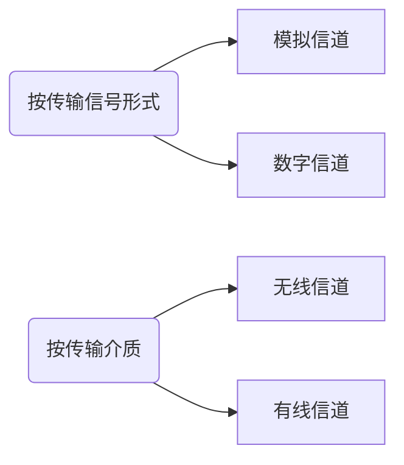

# 第1章 计算机网络体系结构

> - 计算机网络概述
>   - 计算机网络的概念、组成、功能、分类
>   - 计算机网络的性能指标
> - 计算机网络体系结构与参考模型
>   - 计算机网络分层结构，计算机网络协议、接口、服务的概念
>   - ISO/OSI参考模型和TCP/IP模型

## 1.1 计算机网络概述

### 1.1.1 计算机网络的概念

计算机网络是一个将分散的、具有独立功能的计算机系统，通过通信设备与线路连接起来，由功能完善的软件实现资源共享和信息传递的系统。简而言之——一些互联的、自治的计算机系统的集合

#### 1. 广义观点

- 只要是能实现远程信息处理的系统或能进一步达到资源共享的系统，都是计算机网络

- 广义观点定义了一个计算机通信网络，它在物理上具有计算机网络的雏形，但资源共享能力弱，是计算机网络发展的低级阶段

#### 2. 资源共享观点

- 以能够相互共享资源的方式互连起来的自治计算机系统的集合
  - 目的——资源共享
  - 组成单元——分布在不同地理位置的多台独立的“自治计算机”
  - 网络中的计算机必须遵循的统一规则——网络协议

- 该定义符合目前计算机网络的基本特征

#### 3. 用户透明性观点

存在一个能为用户自动管理资源的网络操作系统，它能够调用用户所需要的资源，而整个网络就像一个大的计算机系统一样对用户是透明的。用户使用网络就像使用一台单一的超级计算机，无须了解网络的存在、资源的位置信息

用户透明性观点定义描述了一个分布式系统，它是网络未来发展追求的目标

### 1.1.2 计算机网络的组成

- 从组成部分上看：
  - 硬件。主要由主机、通信链路、交换设备和通信处理机等组成
  - 软件。主要包括各种实现资源共享的软件和方便用户使用的各种工具软件，软件部分多属于应用层
  - 协议。计算机网络的核心，规定了网络传输数据时所遵循的规范
- 从工作方式上看：
  - 边缘部分。由所有连接到因特网上、供用户直接使用的主机组成，用来进行通信和资源共享
  - 核心部分。由大量的网络和连接这些网络的路由器组成，它为边缘部分提供连通性和交换服务

- 从功能组成上看：
  - 通信子网。由各种传输介质、通信设备和相应的网络协议组成，它使网络具有数据传输、交换、控制和存储的能力，实现联网计算机之间的数据通信
  - 资源子网。是实现资源共享功能的设备及其软件的集合，向网络用户提供共享其他计算机上的硬件资源、软件资源和是数据资源的服务

### 1.1.3 计算机网络的功能

#### 1. 数据通信

#### 2. 资源共享

#### 3. 分布式处理

#### 4. 提高可靠性

#### 5. 负载均衡

### 1.1.4 计算机网络的分类

#### 1. 按分布范围

- 广域网
- 城域网
- 局域网
- 个人区域网

#### 2. 按传输技术

- 广播式网络

- 点对点网络

#### 3. 按拓扑结构

- 总线形
- 星形
- 环形
- 网状

#### 4. 按使用者

- 公用网

- 专用网

#### 5. 按交换技术

- 电路交换网络
- 报文交换网络
- 分组交换网络

#### 6. 按传输介质

- 有线网络
  - 双绞线网络
  - 同轴电缆网络
- 无线网络
  - 蓝牙
  - 微波
  - 无线电

### 1.1.5 计算机网络的标准化工作

因特网的所有标准都以RFC（Request For Comments）的形式在因特网上发布，但并非每个RFC都是因特网标准，RFC要上升为因特网的正式标准需经过：

1. 因特网草案Internet Draft.这个阶段还不是RFC文档
2. 建议标准Proposed Standaard.从这个阶段开始就成为RFC文档
3. 草案标准Draft Standard
4. 因特网标准Internet Standard

在国际上，负责制定、实施相关网络标准的标准化组织众多，主要有：

- 国际标准化组织ISO
- 国际电信联盟ITU
- 国际电气电子工程师协会IEEE

### 1.1.6 计算机网络的性能指标

- 带宽Bandwidth
- 时延Delay
  - 发送时延
  - 传播时延
  - 处理时延
  - 排队时延
- 时延带宽积
- 往返时延Round-Trip Time,RTT
- 吞吐量Throughput
- 速率Speed
- 信道利用率

## 1.2 计算机网络体系结构与参考模型

### 1.2.1 计算机网络分层结构

分层的基本原则：

- 每层都实现一种相对独立的功能，降低大系统的复杂度
- 各层之间界面自然清晰，易于理解，相互交流尽可能少
- 各层功能的精确定义独立于具体的实现方法，可以采用最合适的技术来实现
- 保持下层对上层的独立性，上层单向使用下层提供的服务
- 整个分层结构应能促进标准化工作

> 实体：任何可发送或接收信息的硬件或软件进程，通常是一个特定的软件模块
>
> 服务数据单元SDU：为完成用户所要求的功能而应传送的数据
>
> 协议控制信息PCI：控制协议操作的信息
>
> 协议数据单元PDU：对等层次之间传送的数据单位称为该层的PDU（物理层的PDU称为比特，数据链路层的PDU称为帧，网络层的PDU称为分组，传输层的PDU称为报文段）

具体地，层次结构的含义包括一下几个方面：

1. 第n层的实体不仅要使用第n - 1层的服务来实现自身定义的功能，还要向第n + 1层提供本层的服务，该服务是第n层及其下面各层提供的服务总和
2. 最底层只提供服务，是整个层次结构的基础；中间各层既是下一层的服务使用者，又是上一层的服务提供者；最高层面向用户提供服务
3. 上一层只能通过相邻层间的接口使用下一层的服务，而不能调用其他层的服务；下一层所提供服务的实现细节对上一层透明
4. 两台主机通信时，对等层在逻辑上有一条直接信道，表现为不经过下层就把信息传送到对方

### 1.2.2 计算机网络协议、接口、服务的概念

#### 1. 协议

协议由语法、语义和同步三部分组成

- 语法规定了传输数据的格式
- 语义规定了所要完成的功能
- 同步规定了执行各种操作的条件、时序关系等

一个完整的协议通常应具有线路管理、差错控制、数据转换等功能

#### 2. 接口

同一结点内相邻两层间交换信息的连接点，是一个系统内部的规定

- 每层只能为紧邻的层次之间定义接口，不能跨层定义
- 典型接口上，同一结点相邻两层的实体通过服务访问点（Service Access Point,SAP）进行交互

#### 3. 服务

上层使用下层所提供的服务时必须与下层交换一些命令，这些命令在OSI参看模型中称为服务原语。其分为4类：

- 请求Request
- 指示Indication
- 响应Response
- 证实Confirmation

计算机网络提供的服务可按以下分类：

- 面向连接服务与无连接服务
- 可靠服务和不可靠服务
- 有应答服务和无应答服务

> 在一层内完成的全部功能并非都称为服务，只有能够被高一层实体“看得见”的功能才能称为服务

### 1.2.3 ISO/OSI参考模型和TCP/IP模型

#### 1. OSI参考模型

开发系统互连参考模型：

##### a> 物理层 Physical Layer

传输单位是比特，功能是在物理媒体上为数据端设备透明地传输原始比特流

物理层主要研究以下内容：

- 通信链路与通信结点的连接需要一些电路接口，物理层规定了这些接口的一些参数
- 规定通信链路上传输的信号的意义和电气特征

##### b> 数据链路层 Data Link Layer

传输单位是帧，任务是将网络层传来的IP数据报组装成帧。功能可以概括为成帧、差错控制、流量控制和传输管理等

典型的数据链路层协议有SDLC、HDLC、PPP、STP和帧中继等

##### c> 网络层 Network Layer

传输单位是数据报，主要任务是把网络层的协议数据单元（分组）从源端传到目的端，为分组交换网上的不同主机提供通信服务。关键问题是对分组进行路由选择、并实现流量控制、拥塞控制、差错控制和网际互联等功能

网络层的协议有IP、IPX、ICMP、IGMP、ARP、RARP和OSPF等

##### d> 传输层 Transport Layer

传输单位是报文段（TCP）或用户数据报（UDP），负责主机中两个进程之间的通信，功能是为端到端连接提供可靠的传输服务，为端到端连接提供流量控制、差错控制、服务质量、数据传输管理等服务

数据链路层提供的是点到点的通信，传输层提供的是端到端的通信。通俗理解：点到点可以理解为主机与主机，端到端是指运行在不同主机内的两个进程之间

传输层协议有TCP、UDP

##### e> 会话层 Session Layer

负责管理主机间的会话进程，包括建立、管理和终止进程间的会话。可以使用校验点使通信失效时从校验点继续恢复通信，实现数据同步

##### f> 表示层 Presentation Layer

主要处理在两个通信系统中交换信息的表示方式，数据压缩、加密和解密也是表示层可提供的数据表示变换功能

##### g> 应用层 Application Layer

为特定类型的网络应用提供访问OSI参考模型环境的手段

#### 2. TCP/IP模型

##### a> 网络接口层

从主机或结点接收IP分组，并把它们发送到指定的物理网络上

##### b> 网际层

将分组发往任何网络，并为之独立地选择合适的路由，但不保证各个分组有序地到达，各个分组的有序交付由高层负责。网际层定义了标准的分组格式和协议，即IP

##### c> 传输层

发送端和目的端主机上的对等实体进行会话

##### d> 应用层

#### 3. TCP/IP模型与OSI参考模型的比较

相同点：

- 都采取分层的体系结构，将庞大复杂的问题划分为若干较容易处理的、范围较小的问题，而且分层的功能也大体相似
- 二者都是基于独立的协议栈的概念
- 二者都可以解决异构网络的互连，实现世界上不同厂家生产的计算机之间的通信

不同点：

- OSI参考模型的最大贡献就是精确地定义了三个主要概念：服务、协议和接口，这与现代的面向对象程序设计思想非常吻合。而TCP/IP模型在这三个概念上却没有明确区分
- OSI产生在协议发明之前，没有偏向于任何特定的协议，通用性良好。但设计者在协议方面没有太多经验，不知道把哪些功能放到哪一层更好。TCP/IP模型正好相反

- TCP/IP模型在设计之初就考虑到了多种异构网的互连问题，并将网际协议（IP）作为一个单独的层次
- OSI参考模型在网络层支持无连接和面向连接的通信，但在传输层仅有面向连接的通信。而TCP/IP模型认为可靠性是端到端的问题，因此它在网际层仅有一种无连接的通信模式，但传输层支持无连接和面向连接两种模式

# 第2章 物理层

> - 通信基础
>
>   - 信道、信号、带宽、码元、波特、速率、信源与信宿等基本概念
>   - 奈奎斯特定理与香农定理，编码与调制
>   - 电路交换、报文交换与分组交换，数据包与虚电路
>
> - 传输介质
>
>   双绞线、同轴电缆、光纤与无线传输介质，物理层接口的特性
>
> - 物理层设备
>
>   - 中继器，集线器

## 2.1 通信基础

### 2.1.1 基本概念

#### 1. 数据、信号与码元

- 数据是指传送信息的实体
- 信号是数据的电气或电磁表现
  - 连续变化的数据（或信号）称为模拟数据（或模拟信号）
  - 取值仅允许为有限的几个离散数值的数据（或信号）称为数字数据（或数字信号）
- 码元是指用一个固定时长的信号波形（数字脉冲）表示一位k进制数字
  - 代表不同离散数值的基本波形
  - 是数字通信中数字信号的计量单位
  - 这个时长内的信号称为k进制码元，而该时长称为码元宽度

#### 2. 信源、信道与信宿

- 信源是产生和发送数据的源头
- 信宿是接收数据的终点
  - 发送端信源发出的信息需要通过变换器转换成适合于在信道上传输的的信号，而通过信道传输到接收端的信号先由反变换器转换成原始信息，再发送给信宿
- 信道与电路并不等同，信道是信号的传输媒介

信道上传送的信号分为：

- 基带信号。在数字信道上传输（称为基带传输）
- 宽带信号。在模拟信道上传输（称为宽带传输）

从通信双方信息的交互方式看，可分为三种基本方式：

1. 单向通信
2. 半双工通信。双方都可发送或接收信息，但任意一方不能同时发送和接收
3. 全双工通信。通信双方可以同时发送和接收消息

信道的极限容量是指信道的最高码元传输速率或信道的极限信息传输速率

#### 3. 速率、波特与带宽

- 速率指数据传输速率，表示单位时间内传输的数据量，可以用码元传输速率和信息传输速率表示：
  - 码元传输速率。又称波特率，表示单位时间内数字通信系统所传输的码元个数，单位是波特（Baud）。码元速率与进制数无关
  - 信息传输速率。又称信息速率、比特率等，表示单位时间内数字通信系统传输的二进制码元个数（即比特数），单位是比特/秒（b/s）

- 带宽原指信号具有的频带宽度，单位是赫兹（Hz）
  - 带宽与数据率存在数值上的互换关系，因此常用来表示网络的通信线路所能传输数据的能力
  - 因此，带宽表示单位时间内从网络中的某一点到另一点所能通过的“最高数据率”，此时单位是b/s

### 2.1.2 奈奎斯特定理与香农定理

#### 1. 奈奎斯特定理

> 信号中的许多高频分量往往不能通过信道，否则在传输中会衰减，导致接收端收到的信号波形失去码元之间的清晰界限，这种现象称为码间串扰

在理想低通（没有噪声、宽带有限）的信道中，为了避免码间串扰，极限码元传输速率为2W波特，其中W是理想低通信道的带宽。若用V表示每个码元离散电平的数目，则极限数据率为
$$
理想低通信道下的极限数据传输速率 = 2Wlog_2V（单位为b/s）
$$
对于奈氏准则，可以得出：

1. 在任何信道中，码元传输速率是有上限的。如果超出，会出现严重的码间串扰问题，使得接收端不可能完全正确识别码元
2. 信道的频带越宽（即通过的信号高频分量越多），就可用更高的速率进行码元的有效传输
3. 奈氏准则给出了码元传输速率的限制，但并未对信息传输速率给出限制，即未对一个码元可以对应多少个二进制位给出限制

由于码元传输速率受奈氏准则制约，所以要提高数据传输速率，就必须使每个码元携带更多比特的信息量，此时需要采用多元制的调制方法

#### 2. 香农定理

Shannon定理给出了带宽受限且有高斯白噪声干扰的信道的极限数据传输速率，当用此速率进行传输时，可以做到不产生误差，香农定理定义为：
$$
信道的极限数据传输速率 = Wlog_2(1 + S / N)（单位为b/s）
$$
其中，W为信道的带宽，S为信道所传输信号的平均功率，N为信道内部的高斯噪声功率。S/N为信噪比，即信号的平均功率与噪声的平均功率之比，信噪比 = 10log~10~(S/N)（单位为dB）

对于香农定理，可以得出：

1. 信道的带宽或信道中的信噪比越大，信息的极限传输速率越高
2. 对一定的传输带宽和一定的信噪比，信息传输速率的上限是确定的
3. 只要信息传输速率低于信道的极限传输速率，就能找到某种方法来实现无差错的传输
4. Shannon定理得出的是极限信息传输速率，实际信道能达到的传输速率要比它低不少

> 奈氏准则只考虑了带宽与极限码元传输速率的关系，而香农定理不仅考虑到了带宽，也考虑了信噪比。这从另一个侧面表明，一个码元对应的二进制位数是有限的

### 2.1.3 编码与调制

- 把数据变化成模拟信号的过程称为调制
- 把数据变换为数字信号的过程称为编码

#### 1. 数字数据编码为数字信号

数字数据编码用于基带传输中，即在基本不改变数字数据信号频率的情况下，直接传输数字信号，常用的数字数据编码有：

- 归零编码 RZ 高电平代表1、低电平代表0（或者相反），每个时钟周期的中间均跳到低电平，接收方根据该跳变调整本方的时钟基准，这就为传输双方提供了自同步机制。由于归零需要占用一定带宽，因此传输速率受到了一定影响
- 非归零编码 NRZ 无法传递时钟信号，双方难以同步，因此若要高速同步数据，则需要都带有时钟线
- 反向非归零编码 NRZI 用信号的翻转代表0、保持不变代表1.翻转的信号本身可以作为一种通知机制。这种编码方式集成了前两种的优点，既能传输时钟信号，又能尽量不损失系统带宽。USB2.0通信的编码方式就是NRZI
- 曼彻斯特编码 将一个码元分成两个相等的间隔，前一个间隔为高电平而后一个为低电平表示码元1；反之表示码元0.该编码的特点是，在每个码元的中间出现电平跳变，位中间的跳变既作为时钟信号，又作为数据信号，但它所占的频带宽度是原始基带宽度的两倍。以太网使用的编码方式
- 差分曼彻斯特编码 常用于局域网传输。规则为：若码元为1,则前半个码元的电平与上一个码元的后半个的电平相同；若码元为0,则情形相反。特点是，在每个码元的中间都有一次电平的跳转，可以实现自同步，且抗干扰性较好
- 4B/5B编码 

#### 2. 数字数据调制为模拟信号

基本的数字调制方法有：

- 幅移键控（ASK）通过改变载波信号的振幅来表示数字信号1和0,而载波的频率和相位不变。比较容易实现，但抗干扰能力差

- 频移键控（FSK）通过改变载波信号的频率来表示数字信号1和0,而载波的振幅和相位不变。容易实现，抗干扰能力强，目前应用较为广泛

- 相移键控（PSK）通过改变载波信号的相位来表示数字信号1和0,而载波的频率和振幅不变。又分为绝对调相和相对调相

- 正交振幅调制（QAM）在频率相同的前提下，将ASK和PSK结合起来，形成叠加信号。设波特率为B,采用m个相位，每个相位有n中振幅，则该QAM技术的数据传输速率R为
  $$
  R = Blog_2(mn)（单位为b/s）
  $$

#### 3. 模拟数据编码为数字信号

最典型的例子是常用于对音频信号进行编码的脉码调制（PCM）。主要包括三个步骤，即采样、量化和编码

采样定理：采样频率必须大于等于最大频率的两倍，才能保证采样后的数字信号完整的保留原始模拟信号的信息（采样定理又称奈奎斯特定理）

- 采样是指对模拟信号进行周期性扫描，把时间上连续的信号变成时间上离散的信号，根据采样定理，当采样的频率大于等于模拟数据的频带带宽两倍时，所得的离散信号可以无失真地代表被采样的模拟数据
- 量化是把采样取得的电平幅值按一定的分级标度转化为对应的数字值并取整数，这样就把连续的电平幅值转换为离散的数字量。采样和量化的实质就是分割和转换
- 编码是把量化的结果转换为与之对应的二进制编码

#### 4. 模拟数据调制为模拟信号

可以使用频分复用（FDM），充分利用带宽资源。电话机和本地局交换机采用模拟信号传输模拟数据的编码方式，模拟的声音数据是加载到模拟的载波信号中传输的

### 2.1.4 电路交换、报文交换和分组交换

#### 1. 电路交换

- 两个结点之间必须先建立一条专用的物理通信路径
- 路径可能经过许多中间结点
- 路径在数据传输期间被独占，通信结束后才释放

电路交换分为三个阶段：连接建立、数据传输和连接释放。关键点是，在数据传输的过程中，用户始终占用端到端的固定传输带宽

优点如下：

- 通信时延小
- 有序传输
- 没有冲突
- 适用范围广
- 实时性强
- 控制简单

缺点：

- 建立连接时间长
- 线路独占
- 灵活性差
- 难以规格化

#### 2. 报文交换

报文携带有目标地址、源地址等信息。报文交换在交换结点采用的是存储转发的传输方式，优点如下：

- 无须建立连接
- 动态分配线路
- 提高线路可靠性
- 提高线路利用率
- 提供多目标服务

缺点：

- 由于数据进入交换结点后要经历存储、转发这一过程，因此会引起转发时延
- 报文交换对报文的大小没有限制，这就要求网络结点需要有较大的缓存空间

#### 3. 分组交换

分组交换限制了每次传送的数据块大小的上限，再加上一些必要的控制信息（如源地址、目的地址和编号信息等）构成分组（Packet）。网络结点根据控制信息把分组送到下一个结点，下一个结点接收到分组后，暂存并排队等待传输，然后根据分组控制信息选择它的下一结点，直到到达目的结点。优点如下：

- 无建立时延
- 线路利用率高
- 简化了存储管理
- 加速传输
- 减少了出错概率和重发数据量

缺点：

- 存在存储转发时延
- 需要传输额外的信息量
- 当分组交换采用数据报服务时，可能会出现失序、丢失或重复分组

### 2.1.5 数据报与虚电路

分组交换根据其通信子网向端点系统提供的服务，可进一步分为面向连接的虚电路方式和无连接的数据报方式

#### 1. 数据报

作为通信子网用户的端系统发送一个报文时，在端系统中实现的高层协议先把报文拆成若干带有序号的数据单元，并在网络层加上地址等控制信息后形成数据报分组（即网络层的PDU）。中间结点存储分组很短一段时间，找到最佳的路由后，尽快转发每个分组。不同的分组可以走不同的路径，也可以按不同的顺序到达目的结点

- 发送分组前不需要建立连接
- 网络尽最大努力交付，传输不保证可靠性，所以可能丢失
- 发送的分组中要包括发送端和接收端的完整地址，以便可以独立运输
- 分组在交换结点存储转发时，需要排队等候处理，这会带来一定时延
- 网络具有冗余路径，当某个交换结点或一条链路出现故障时，可相应地更新转发表，寻找新路径，对故障的适应能力强
- 收发双发不独占某条链路，资源利用率较高

#### 2. 虚电路

在分组发送之前，要求在发送方和接收方建立一条逻辑上相连的虚电路，并且连接一旦建立，就固定了虚电路所对应的物理路径。与电路交换类似，整个通信过程分三个阶段：虚电路建立、数据传输与虚电路释放

- 虚电路通信链路的建立和拆除需要时间开销，对交互式应用和小量的短分组情况显得浪费，但对长时间、频繁的数据交换效率较高
- 虚电路的路由选择体现在连接建立阶段，连接建立后，就确定了传输路径
- 虚电路提供了可靠的通信功能，能保证每个分组正确且有序到达。此外，还可进行流量控制
- 当网络中的某个结点或某条链路出现故障而彻底失效时，所有经过该结点或该链路的虚电路将遭到破坏
- 分组首部不包含目的地址，包含的是虚电路标识符，相对于数据报方式，其开销小

数据报服务和虚电路服务的比较：

|                    | 数据报服务                                                   | 虚电路服务                                                 |
| ------------------ | ------------------------------------------------------------ | ---------------------------------------------------------- |
| 连接的建立         | 不需要                                                       | 必须有                                                     |
| 目的地址           | 每个分组都有完整的目的地址                                   | 仅在建立连接阶段时使用，之后每个分组使用长度较短的虚电路号 |
| 路由选择           | 每个分组独立地进行路由选择和转发                             | 属于同一条虚电路的分组按照同一路由的转发                   |
| 分组顺序           | 不保证分组的有序到达                                         | 保证分组的有序到达                                         |
| 可靠性             | 不保证可靠通信，可靠性由用户主机来保证                       | 可靠性由网络保证                                           |
| 对网络故障的适应性 | 出故障的结点丢失分组，其他分组路径选择发生变化时可以正常传输 | 所有经过故障结点的虚电路均不能正常工作                     |
| 差错处理和流量控制 | 由用户主机进行流量控制，不保证数据报的可靠性                 | 可由分组交换网负责，也可由用户主机负责                     |

## 2.2 传输介质

### 2.2.1 双绞线、同轴电缆、光纤与无线传输介质

- 导向传输介质。电磁波被导向沿着固定媒介传播
- 非导向传输介质可以是空气、真空或海水等

#### 1. 双绞线

由两根采用一定规则并排绞合的、相互绝缘的铜导线组成

- 价格便宜
- 带宽取决于铜线的粗细和传输的距离
- 距离太远时，对于模拟传输，要用放大器放大衰减的信号；对于数字传输，要用中继器将失真的信号整形
- 为进一步提高抗电磁干扰的能力，可在双绞线外面再加上一层，即用金属丝编织成的屏蔽层，这就是屏蔽双绞线（STP）

#### 2. 同轴电缆

由内导体、绝缘层、网状编织屏蔽层和塑料外层

- 按特性阻抗数值的不同
  - 50$\Omega$同轴电缆，主要用于传输基带数字信号，又称基带同轴电缆，在局域网中应用广泛
  - 75$\Omega$同轴电缆，主要用于传输宽带信号，又称宽带同轴电缆，主要用于有线电视系统
- 具有良好的抗干扰特性，被广泛用于传输较高速率的数据
- 传输距离更远，价格较双绞线贵

#### 3. 光纤

利用光导纤维传递光脉冲来进行通信

- 传输损耗小，中继距离长，对远距离传输特别经济
- 抗雷电和电磁干扰性能好
- 无串音干扰，保密性好，也不易被窃听或截取数据
- 体积小，重量轻

#### 4. 无线传输介质

- 无线电波
- 微波、红外线和激光

### 2.2.2 物理层接口的特性

- 机械特性。指明接口所用接线器的形状和尺寸、引脚数目和排列、固定和锁定装置等
- 电气特性。指明在接口电缆的各条线上出现的电压的范围
- 功能特性。指明某条线上出现的某一电平的电压表示何种意义
- 过程特性。或称规程特性。指明对于不同功能的各种可能事件的出现顺序

> 常用的物理层接口标准有 EIA RS-232-C、ADSL和SONET/SDH等

## 2.3 物理层设备

### 2.3.1 中继器

将信号整形并放大再转发出去，其原理是信号再生

> 5-4-3规则：用4个中继器串联的5段通信介质中只有3段可以挂接计算机
>
> 放大器和中继器都起放大作用，只不过放大器放大的是模拟信号，原理是将衰减的信号放大，而中继器放大的是数字信号，原理是将衰减的信号整形再生

### 2.3.2 集线器

Hub实质上是一个多端口的中继器，在网络中只起信号放大和转发作用，扩大网络的传输范围，不具备信号的定向传送能力

# 第3章 数据链路层

> - 数据链路层的功能
> - 组帧
> - 差错控制
>   - 检错编码，纠错编码
> - 流量控制与可靠传输机制
>   - 流量控制、可靠传输与滑动窗口机制，停止-等待协议
>   - 后退N帧协议（GBN），选择重传协议（SR）
> - 介质访问控制、
>   1. 信道划分：频分多路复用、时分多路复用、波分多路复用、码分多路复用的概念和基本原理
>   2. 随即访问：ALOHA协议，CSMA协议，CSMA/CD协议，CSMA/CA协议
>   3. 令牌传递协议
> - 局域网
>   - 局域网的基本概念与体系结构，以太网与IEEE802.3
>   - IEEE802.11无线局域网，VLAN基本概念与基本原理
> - 广域网
>   - 广域网的基本概念，PPP协议
> - 数据链路层设备
>   - 局域网交换机极其工作原理

## 3.1 数据链路层的功能

加强物理层传输原始比特流的功能，将物理层提供的可能出错的物理连接改造为逻辑上无差错的数据链路，使之对网络层表现为一条无差错的链路

### 3.1.1 为网络层提供服务

对网络层而言，数据链路层的基本任务是将源机器中来自网络层的数据传输到目标机器的网络层：

- 无确认的无连接服务
- 有确认的无连接服务
- 有确认的面向连接的服务

确认指的是目的机器收到数据帧是向源机器发送的确认收到信号，连接是源机器在发送数据帧时建立链路连接

> 有连接就一定要有确认，即不存在无确认的面向连接的服务

### 3.1.2 链路管理

数据链路层连接的建立、维持和释放过程称为链路管理，主要用于面向连接的服务。

### 3.1.3 帧定界、帧同步与透明传输

- 两台主机之间传输信息，必须将网络层的分组封装成帧，以帧的格式进行传输。将一段数据的前后分别添加首部和尾部，就构成了帧

- 帧长 = 数据长度 + 首部长度 + 尾部长度
- 首部尾部含有很多控制信息，它们的一个重要作用就是确定帧的界限，即帧定界
- 帧同步是指接收方应能从接收到的二进制比特流中区分出帧的起始与终止
- 为了提供传输效率，应当使帧的数据部分长度尽可能大于首部和尾部长度，但每种数据链路层协议都规定了帧的数据部分的长度上限——最大传送单元（MTU）
- 如果数据中恰好出现与帧定界符相同的比特组合，会被误认为传输结束而丢弃后面的数据。透明传输就是不管所传数据是什么样的比特组合，都应当能在链路上传送

### 3.1.4 流量控制

流量控制实际上就是限制发送方的数据流量，使其发送速率不超过接收方的接收能力。流量控制并不是数据链路层独有的功能，许多高层协议中也有这个功能，只不过控制的对象不同。对于数据链路层来说，控制的是相邻两结点之间数据链路上的流量，而对于传输层来说，控制的则是从源端到目的端的流量

> 在OSI体系结构中，数据链路层具有流量控制的功能。而在TCP/IP体系结构中，流量控制功能被转移到了传输层

### 3.1.5 差错控制

用以使发送方确定接收方是否正确收到由其发送的数据的方法，通常分为位错和帧错。通常采用循环冗余校验（CRC）方式发现位错，通过自动重传请求（ARQ）方式来重传出错的帧，具体做法是：让发送方将要发送的数据帧附加一定的CRC冗余检错码一并发送，接收方根据检错码对数据帧进行错误检测，若发现错误则丢弃，发送方超时重传该数据帧。ARQ法只需返回较少的控制信息就可有效地确认所发数据帧是否被正确接收

在数据链路层引入定时器和编号机制，能保证每一帧最终都能有且仅有一次正确地交付给目的结点

## 3.2 组帧

组帧主要解决帧定界、帧同步和透明传输等问题，通常有4种方法实现

### 3.2.1 字符计数法

在帧头部使用一个计数字段来标明帧内字符数。如果计数字段出错，收发双发将失去同步

### 3.2.2 字符填充的首尾定界符法

首尾加入特殊字符，数据中出现特殊字符，插入转义字符

### 3.2.3 零比特填充的首尾标志法

使用01111110来标志一帧的开始和结束，数据部分出现5个连续1,将自动在其后插入一个0.接收方收到5个连续1时，自动删除后面紧跟的0,以恢复原信息

### 3.2.4 违规编码法

高-高和低-低电平对在数据比特中是违规的，可以借用这些违规编码序列来定界帧的起始和终止。违规编码法不需要采用任何填充技术，便能实现透明传输，但只适用于采用冗余编码的特殊编码环境

> 由于字符计数法中计数字段的脆弱性和字符填充法实现上的复杂性和不兼容性，目前较常用的组帧是零比特填充法和违规编码法

## 3.3 差错控制

### 3.3.1 检错编码

检错编码都采用冗余编码技术，核心思想是在有效数据被发送之前，先按某种关系附加一定的冗余位，构成一个符合某一规则的码字后再发送

#### 1. 奇偶校验码

附加一个检验元后，码字中1的个数是奇数还是偶数。只能检测奇数位的出错情况，但并不知道哪些位错了，也不能发现偶数位的出错情况

#### 2. 循环冗余码

> CRC具有纠错功能，但数据链路层只使用了它的检错功能

### 3.3.2 纠错编码

## 3.4 流量控制与可靠传输机制

### 3.4.1 流量控制、可靠传输与滑动窗口机制

流量控制的基本方法是由接收方控制发送方发送数据的速率，常见的方法是停止-等待协议和滑动窗口协议

#### 1. 停止-等待流量控制基本原理

发送方每发送一帧，要等待接收方的应答信号；接收方在收到帧后，需要回复，表示可以继续接收

#### 2. 滑动窗口流量控制基本原理

在任意时刻，发送方和接收方分别维护一组可以发送和接收的数据帧的序号，分别为发送窗口和接收窗口。接收方只接收窗口允许的帧序号，不允许的丢弃

- 只有接收窗口向前滑动，发送窗口才有机会向前
- 接收窗口的大小为1时，可以保证帧的有序接收
- 数据链路层的滑动窗口协议中，窗口的大小是固定的
- 从滑动窗口概念是看，停止-等待协议、后退N帧协议和选择重传协议只在发送窗口和接收窗口的大小上有所区别
  - 停止-等待协议。发送窗口 = 接收窗口 = 1
  - 后退N帧协议。发送窗口 > 1，接收窗口 = 1
  - 选择重传协议。发送窗口 > 1， 接收窗口 > 1

#### 3. 可靠传输机制

数据链路层的可靠性通常使用确认和超时重传两种机制来完成

ARQ通过接收方请求发送方重传出错的数据帧来恢复出错的帧，传统自动重传请求分三种：

- 停止-等待ARQ
- 后退N帧ARQ
- 选择性重传ARQ

### 3.4.2 单帧滑动窗口与停止-等待协议

在停止-等待协议中，除了数据帧丢失外，还可能：

- 到达目的的帧已被破坏，为此，可在源站设置计时器
- 数据帧完好而确认帧被破坏，发送方收不到确认帧，会重传。为此，发送的帧用0和1标识，确认帧同理。当接收方连续收到两个序号相同的帧，表明发送方启用了超时重传；当发送方连续收到了两个相同序号的确认帧，表示接收方收到了重复帧

### 3.4.3 多帧滑动窗口与后退N帧协议（GBN）

GBN一方面因连续发送数据帧而提高了信道的利用率，但是又因为重传时，必须把原本已经正确的帧也重传，这种做法又使传送效率降低。因此，如果信道的传输质量很差导致误码率较大时，GBN不一定优于停止-等待协议

### 3.4.4 多帧滑动窗口与选择重传协议（SR）

SR可以避免重复传输已经正确接收的帧，但在接收端需要设置具有相当容量的缓冲区来暂存那些未按序正确接收的帧。

> 信道的效率，也称信道利用率。信道效率是对发送方而言的，是指发送方在一个发送周期内，有效地发送数据所需要的时间占整个发送周期的比率
>
> 信道吞吐量 = 信道利用率 * 发送方的发送速率

## 3.5 介质访问控制

MAC主要任务是：为使用介质的每个结点隔离来自同一信道上其他结点所传送的信号，以协调活动结点的传输

### 3.5.1 信道划分介质访问控制

信道划分的实质就是通过分时、分频、分码等方法把原来的一条广播信道，逻辑上分为几条用于两个结点之间通信的互不干扰的子信道，实际上就是把广播信道转变为点对点信道

信道划分介质访问控制分为以下4种：

#### 1. 频分多路复用 FDM

充分利用了传输介质的带宽，系统效率较高，由于技术较为成熟，实现也较容易

#### 2. 时分多路复用 TDM

由于计算机数据的突发性，一个用户对已经分配到的子信道的利用率一般不高。统计时分多路复用（STDM，又称异步时分多路复用）是TDM的一种改进，它采用STDM帧，STDM帧并不固定分配时隙，当中断有数据要传送时，才会分配到时间片，因此可以提高线路的利用率

#### 3. 波分多路复用 WDM

光的频分多路复用

#### 4. 码分多路复用 CDM

采用不同的编码来区分各路原始信号的一种复用方式，与FDM和TDM不同，它既可以共享信道的频率，又共享时间

码分多路复用技术具有频谱利用率高、抗干扰能力强、保密性强、语音质量好等优点，还可以减少投资和降低运行成本，主要用于无线通信系统，特别是移动通信系统

### 3.5.2 随机访问介质访问控制

所有用户根据自己意愿随机发送信息，占用信道全部速率。为解决随机介入发生的碰撞，每个用户需要按照一定规则反复重传它的帧，直到该帧无碰撞地通过。这些规则就是随机访问介质访问控制协议，它们的核心思想是：胜利者通过争用获得信道，因此又称争用型协议

> 介质访问控制采用信道划分机制，那么结点之间的通信要么共享空间，要么共享时间，要么两者都共享；而随机访问控制机制，各结点间既不共享时间，也不共享空间，其实质是一种将广播信道转化为点到点信道行为

#### 1. ALOHA协议

- 纯ALOHA协议的基本思想是，当网络中的任一站点需要发送数据，可以不进行检测就发送。如果一段时间内未收到确认，那么该站点就认为传输过程中发生了冲突。发送站点需等待一段时间后再发送，直至成功
- 时隙ALOHA协议把所有各站在时间上同步起来，并将时间划分为一段段等长的时隙（Slot），规定只能在每个时隙开始时才能发送一个帧。从而避免了用户发送数据的随意性，减少了数据产生冲突的可能性，提高了信道的利用率

#### 2. CSMA协议

与ALOHA协议主要区别是多了一个载波监听装置

- 1-坚持CSMA。监听到信道忙后，继续监听；监听到空闲后，发送帧的概率为1,即立即发送数据
- 非坚持CSMA。一个结点要发送数据，如果信道空闲，立即发送；如果信道忙，放弃监听，等待一个随机时间后重复上述过程
  - 降低了多个结点等待信道空闲后同时发送数据导致冲突的概率，但增加了数据在网络中的平均延迟
- p-坚持CSMA。信道忙，继续监听；空闲，以概率p发送数据，以1-p概率推迟到下一时隙

#### 3. CSMA/CD协议

载波监听多路访问/碰撞检测协议适用于总线形网络或半双工网络环境

- 载波监听是指每个站点在发送前和发送中都必须不停地检测信道
  - 发送前检测是为了获得发送权
  - 发送中检测是为了及时发现发送的数据是否发生了碰撞
- 碰撞检测就是边发送边监听，监听到了碰撞，立即停止发送，等待一段随机时间后，重新尝试发送
- 工作流程可简单概括为：先听后发，边听边发，冲突停发，随机重发

#### 4. CSMA/CA协议

基本思想是在发送数据时先广播告知其他结点，让其他结点在某段时间内不要发送数据，以免出现碰撞。

CSMA/CD与CSMA/CA主要区别：

- CSMA/CD可以检测冲突，但无法避免；CSMA/CA发送数据的同时不能检测有无冲突，本结点处没有冲突并不意味着接收结点处没有冲突，只能尽量避免
- 传输介质不同。CSMA/CD用于总线形以太网，CSMA/CA用于无线局域网802.11a/b/g/n等
- 检测方式不同。CSMA/CD通过电缆中的电压变化来检测；而CSMA/CA采用能量检测、载波检测和能量载波混合检测三种方式

### 3.5.3 轮询访问介质访问控制

既不共享时间，也不共享空间，实际上就是在随机介质访问控制的基础上，限定了有权力发送数据的结点只能有一个

## 3.6 局域网

### 3.6.1 局域网的基本概念和体系结构

- LAN主要特点：
  - 为一个单位所有，且地理范围和站点数目均有限
  - 所有站点共享较高的总带宽
  - 较低的时延和较低的误码率
  - 各站为平等关系而非主从关系
  - 能进行广播和组播

- LAN的特性主要由拓扑结构、传输介质、介质访问控制三要素决定，最重要的是介质访问控制方式，它决定着局域网的技术特性

- 常见的局域网拓扑结构有四类：星形、环形、总线形、星形和总线形结合的复合型

- 局域网可以使用双绞线、铜缆和光纤等多种传输介质，其中双绞线为主流介质
- 局域网的介质访问控制方法主要有CSMA/CD、令牌总线和令牌环
- 三种特殊的局域网拓扑实现如下：
  - 以太网。逻辑拓扑是总线形，物理拓扑是星形或拓展星形结构
  - 令牌环（IEEE 802.5）。逻辑拓扑是环形，物理拓扑是星形
  - FDDI（光纤分布数字接口，IEEE802.8）。逻辑拓扑是环形，物理拓扑是双环结构

### 3.6.2 以太网与IEEE 802.3

IEEE802.3标准是一种基带总线形的局域网标准，描述了物理层和数据链路层的MAC子层的实现方法

以太网采用两项措施简化通信：无连接的工作方式和发送的数据都使用曼彻斯特编码的信号

#### 1. 以太网的传输介质与网卡

| 参数         | 10BASE5              | 10BASE2              | 10BASE-T     | 10BASE-FL       |
| ------------ | -------------------- | -------------------- | ------------ | --------------- |
| 传输媒体     | 基带同轴电缆（粗缆） | 基带同轴电缆（细缆） | 非屏蔽双绞线 | 光纤对（850nm） |
| 编码         | 曼彻斯特编码         | 曼彻斯特编码         | 曼彻斯特编码 | 曼彻斯特编码    |
| 拓扑结构     | 总线形               | 总线形               | 星形         | 点对点          |
| 最大段长     | 500m                 | 185m                 | 100m         | 2000m           |
| 最多结点数目 | 100                  | 30                   | 2            | 2               |

#### 2. 以太网的MAC帧

#### 3. 高速以太网

### 3.6.3 IEEE802.11无线局域网

#### 1. 无线局域网的组成

- 有固定基础设施无线局域网
- 无固定基础设施移动自组织网络

#### 2. 802.11局域网的MAC帧

共三种类型：数据帧、控制帧和管理帧

- 数据帧
  - MAC首部，共30字节，帧的复杂性都在MAC首部
  - 帧主体，数据部分，不超过2312字节，比以太网最大长度长很多
  - 帧校验序列FCS是尾部，共4字节

### 3.6.4 VLAN基本概念与基本原理

## 3.7 广域网

### 3.7.1 广域网的基本概念

|                 | 广域网                                                       | 局域网                 |
| --------------- | ------------------------------------------------------------ | ---------------------- |
| 覆盖范围        | 很广，通常跨区域                                             | 较小，通常在一个区域内 |
| 连接方式        | 结点之间都是点到点连接，但为了提高网络的可靠性，一个结点交换机往往与多个结点交换机相连 | 普遍采用多点接入技术   |
| OSI参考模型层次 | 物理层、数据链路层、网络层                                   | 物理层、数据链路层     |
| 联系与相似点    | 广域网和局域网都是互联网的重要组成构件，从互联网的角度看，两者平等 连接到一个广域网或一个局域网上的主机在该网内进行通信时，只需要使用其网络的物理地址 |                        |
| 着重点          | 强调资源共享                                                 | 强调数据传输           |

### 3.7.2 PPP协议

PPP协议有三个组成部分：

- 链路控制协议 LCP。用于建立、配置、测试和管理数据链路
- 网络控制协议 NCP
- 一个将IP数据报封装到串行链路的方法

PPP协议的特点：

- PPP提供差错检测但不提供纠错功能，只保证无差错接收（通过硬件进行CRC校验）。是不可靠传输协议，因此也不使用序号和确认机制
- 仅支持点到点的链路通信，不支持多点线路
- PPP只支持全双工链路
- PPP的两端可以运行不同的网络层协议，但仍然可使用同一个PPP进行通信
- PPP是面向字节的，当信息字段出现和标志字段一致的比特组合时，PPP有两种不同的处理方法：
  - 若PPP用在异步线路（默认），则采用字符填充法
  - 若PPP用在SONET/SDH等同步线路，则协议规定采用硬件来完成比特填充

### 3.7.3 HDLC协议

## 3.8 数据链路层设备

### 3.8.1 网桥的基本概念

### 3.8.2 局域网交换机

#### 1. 交换机的原理与特点

以太网交换机实质上就是一个多端口的网桥。以太网交换机的原理是，它检测从以太端口来的数据帧的源和目的地的MAC地址，然后与系统内部的动态查找表进行比较，若数据帧的源MAC地址不在查找表中，则将该地址加入查找表，并将数据帧发送给相应的目的端口

以太网交换机的特点：

- 每个端口都直接与单台主机相连，并且一般都工作在全双工方式
- 能同时连通多对端口
- 即插即用
- 由于使用专用的交换结构芯片，交换速率较高
- 独占传输媒体的带宽

#### 2. 交换机的自学习功能

# 第4章 网络层

> - 网络层的功能
>   - 异构网络互连，路由与转发，SDN基本概念，拥塞控制
> - 路由算法
>   - 静态路由与动态路由，距离-向量路由算法，链路状态路由算法，层次路由
> - IPv4
>   - IPv4分组，IPv4地址与NAT,子网划分与子网掩码、CIDR、路由聚合、ARP、DHCP与ICMP
> - IPv6
>   - IPv6主要特点，IPv6地址
> - 路由协议
>   - 自治系统，域内路由与域间路由，RIP路由协议，OSPF路由协议，BGP路由协议
> - IP组播
>   - 组播的概念，IP组播地址
> - 移动IP
>   - 移动IP的概念，移动IP通信过程
> - 网络层设备
>   - 路由器的组成和功能，路由表与路由转发

# 4.1 网络层的功能

### 4.1.1 异构网络互连

根据所在层次，中继系统分为：

- 物理层中继系统：转发器，集线器
- 数据链路层中继系统：网桥或交换机
- 网络层中继系统：路由器
- 网络层以上的中继系统：网关

网络互连通常是指用路由器进行网络互连和路由选择

### 4.1.2 路由与转发

路由器主要完成两个功能：

- 路由选择
- 分组转发

> 路由表是根据路由选择算法得出的，而转发表是根据路由表得出的。但在讨论路由选择的原理时，不区分二者，笼统使用路由表一词

### 4.1.3 SDN的基本概念

网络层的主要功能是转发和路由选择，可以将网络层抽象为数据平面和控制平面，数据平面负责转发，控制平面负责路由选择

软件定义网络采用集中式的控制平面和分布式的数据平面，两个平面相互隔离，控制平面利用控制-数据接口对数据平面上的路由器进行集中式控制，方便软件来控制网络

SDN的优点：

- 全局集中式控制和分布式高速转发，既利于控制平面的全局优化，又利于高性能的网络转发
- 灵活可编程与性能的平衡
- 降低成本

问题：

- 完全风险
- 瓶颈问题

### 4.1.4 拥塞控制

拥塞控制和流量控制的区别：流量控制往往是指在发送端和接收端之间的点对点通信量的控制，所要做的是抑制发送端的发送速率。而拥塞控制是一个全局性的问题，它必须确保通信子网能够传送待传送的数据，涉及网络中所有的主机、路由器及导致网络传输能力下降的所有因素。方法有两种：

- 开环控制。事先考虑，一种静态预防方法
- 闭环控制。实时监测，动态方法

## 4.2 路由算法

路由器转发分组是通过路由表转发，而路由表是通过各种算法生成的

### 4.2.1 静态路由与动态路由

- 静态路由算法（非自适应路由算法）。由网络管理员手工配置路由信息

- 动态路由算法（自适应路由算法）。路由器上的路由表项通过相互连接的路由器之间彼此交换信息，然后按照一定算法优化得到

### 4.2.2 距离-向量路由算法

所有结点定期将它们的整个路由选择表传送给所有与之直接相邻的结点，表中包含：

- 每条路径的目的地
- 路径的代价（也称距离）

所有结点都监听从其他结点传来的路由选择更新信息，并在下列情况更新自己的路由选择表：

- 被通告一条新的路由，该路由在本结点的路由表中不存在
- 发来的路由信息中有一条到达某个目的地的路由，该路由与当前使用的路由相比，有较短的距离

最常见的距离-向量路由算法是RIP算法，它采用“跳数”作为距离的度量

### 4.2.3 链路状态路由算法

该算法要求每个参与的结点都具有完全的网络拓扑信息，它们执行两项任务：

1. 主动测试所有邻接结点的状态
2. 定期将链路状态传播给所有其他结点

链路状态路由算法主要有三个特征：

- 向本自治系统中所有路由器发送信息
- 发送的信息是与路由器相邻的所有路由器的链路状态
- 只有当链路状态发生变化时，路由器才向所有路由器发送此信息

> 相较之下，距离-向量路由算法可能遇到路由环路等问题

### 4.2.4 层次路由

因特网将整个互联网划分为许多较小的自治系统，每个自治系统拥有自主决定本系统的路由选择协议的权力。据此，因特网把路由选择协议分为两大类：

- 一个自治系统内部使用的称为内部网关协议（IGP），也称域内路由选择，具体的协议有RIP和OSPF等
- 自治系统之间的称为外部网关协议（EGP），也称域间路由选择，具体协议有BGP

## 4.3 IPv4

### 4.3.1 IPv4分组

IP协议定义数据传送的基本单元——IP分组及其正确的数据格式。IP协议也包括一套规则，指明分组如何处理、错误怎样控制

#### 1. IPv4分组的格式

> 在IP数据报首部中有三个关于长度的标记，首部长度、总长度、片偏移，基本单位分别是4B、1B、8B

#### 2. IP数据报分片

一个链路层数据报能承载的最大数据量称为最大传送单元（MTU）

### 4.3.2 IPv4地址与NAT

#### 1. IPv4地址

在各类IP地址中，有些IP地址具有特殊用途，不用做主机的IP地址：

- 主机号全为0表示本网络本身，如202.98.174.0
- 主机号全为1表示本网络的广播地址，又称直接广播地址，如202.98.174.255
- 127.x.x.x保留为环回自检（Loopback Test）地址，此地址表示任意主机本身，目的地址为环回地址的IP数据报永远不会出现在任何网络上
- 32位全为0,即0.0.0.0表示本网络上的本主机
- 32位全为1,即255.255.255.255表示整个TCP/IP网络的广播地址，又称受限广播地址

常见的三种类别IP地址的使用范围：

| 网络类别 | 最大可用网络数 | 第一个可用的网络号 | 最后一个可用的网络号 | 每个网络中的最大主机数 |
| -------- | -------------- | ------------------ | -------------------- | ---------------------- |
| A        | 2^7^ - 2       | 1                  | 126                  | 2^24^ - 2              |
| B        | 2^14^          | 128.0              | 191.255              | 2^16^ - 2              |
| C        | 2^21^          | 192.0.0            | 255.255.255          | 2^8^ - 2               |

IP地址重要特点：

- 每个IP地址都由网络号和主机号两部分组成，因此IP地址是一种分等级的地址结构，分等级的好处是：
  - IP地址管理结构在分配IP地址时只需分配网络号，而主机号则由得到该网络的单位自行分配，方便了IP地址的管理
  - 路由器仅根据目的主机所连接的网络号来转发分组，从而减少了路由表所占的存储空间
- IP地址是标志一台主机和一条链路的接口
- 用转发器或桥接器连接的若干LAN仍然是同一个网络，因此该LAN中所有主机的IP地址的网络号必须相同，但主机号必须不同
- 在IP地址中，所有分配到网络号的网络都是平等的
- 在同一个局域网上的主机或路由器的IP地址中的网络号必须是一样的，路由器总是具有两个或两个以上的IP地址，路由器的每个端口都有一个不同网络号的IP地址

#### 2. 网络地址转换（NAT）

NAT是指通过将专用网络地址转换为公用地址，从而对外隐藏内部管理的IP地址

### 4.3.3 子网划分与子网掩码、CIDR

#### 1. 子网划分

两级IP地址的缺点：

- IP地址空间的利用率有时很低
- 给每个物理网络分配一个网络号会使路由表变得太大而使网络性能变坏
- 两级的IP地址不够灵活

子网划分的基本思路如下：

- 子网划分纯属一个单位内部的事。单位对外仍然表现为没有划分子网的网络
- 从主机号借用若干比特作为子网号，三级IP地址的结构就是：网络号，子网号，主机号
- 凡是从其他网络发送给本单位某台主机的IP数据报，仍然是根据IP数据报的目的网络号，先找到连接到本单位网络上的路由器。然后该路由器在收到IP数据报后，按目的网络号和子网号找到目的子网。最后把IP数据报直接交付给目的主机

#### 2. 子网掩码

计算机只需将IP地址和其对应的子网掩码逐位与，就可得出相应子网的网络地址

#### 3. 无分类编制CIDR

CIDR查找路由表的方法：为了更加有效地查找最长前缀匹配，通常将无分类编制的路由表存放在一种层次式数据结构中，然后自上而下地按层次进行查找。这里最常用的数据结构就是二叉线索

#### 4. 网络层转发分组的过程

1. 从收到的IP分组的首部提取目的主机的IP地址D
2. 若查找到特定主机路由，就按照这条路由的下一条转发分组；否则从转发表中的下一条（即按前缀长度的开始）开始检查，执行步骤3

3. 将这一行的子网掩码与目的地址D进行按位与运算。若运算结果与本行的前缀匹配，则查找结束，按照“下一跳”指出的进行处理。否则，若转发表还有下一行，则对下一行进行检查，重复步骤3.否则，执行步骤4
4. 若转发表中有一个默认路由，则把分组传送给默认路由；否则，报告转发分组出错

### 4.3.4 ARP、DHCP和ICMP

#### 1. IP地址与硬件地址

> 路由器由于互连多个网络，因此它不仅有多个IP地址，也有多个硬件地址

#### 2. 地址解析协议 ARP

从IP地址到硬件地址的解析是自动进行的，主机的用户并不知道这种地址解析过程。只要主机或路由器和本网络上的另一个已知IP地址的主机或路由器进行通信，ARP就会自动地将这个IP地址解析为数据链路层所需要的硬件地址

#### 3. 动态主机配置协议 DHCP

DHCP常用于给主机动态地分配IP地址，它提供了即插即用的联网机制，这种机制允许一台计算机加入新的网络和获取IP地址而不用手工参与。DHCP是应用层协议，它是基于UDP的

DHCP工作原理：使用客户/服务器模式。需要IP地址的主机在启动时就向DHCP服务器广播发送报文，所有主机都能收到，但只有DHCP服务器可以回答。DHCP服务器先从其数据库中查找该计算机的配置信息。若找到，则返回找到的信息。若没有，则从服务器的IP地址池中取一个地址分配给该计算机。DHCP服务器的回答报文称为提供报文

#### 4. 网际控制报文协议 ICMP

为提高IP数据报交付成功的机会，在网络层使用ICMP来让主机或路由器报告差错和异常情况。ICMP报文作为IP层数据报的数据，加上数据报的首部，组成IP数据报发送出去

ICMP报文的种类有两种：ICMP差错报告报文和ICMP询问报文

ICMP差错报告报文用于目标主机或到目标主机路径上的路由器向源主机报告差错和异常情况，共有以下5中常用类型：

- 终点不可达

- 源点抑制
- 时间超过
- 参数问题
- 改变路由（重定向）

不应发送ICMP差错报告报文的几种情况如下：

- 对ICMP差错报告报文不再发送ICMP差错报告报文
- 对第一个分片的数据报片的所有后续数据报片
- 对具有组播地址的数据报
- 对具有特殊地址的数据报

ICMP询问报文有4种类型：回送请求和回答报文、时间戳请求和回答报文、地址掩码请求和回答报文、路由器询问和通告报文，最常用的是前两类

ICMP两个常见应用是分组网间探测PING和Traceroute.其中PING使用两ICMP回送请求和回答报文，Traceroute使用了ICMP时间超过报文

> PIGN工作在应用层，它直接使用网络层的ICMP,而未使用传输层的TCP或UDP.Traceroute/Tracert工作在网络层

## 4.4 IPv6

### 4.4.1 IPv6的主要特点

解决IP地址耗尽有三种措施：

1. 采用无类别编制CIDR，使IP地址的分配更合理
2. 采用网络地址转换以节省全球IP地址

3. 采用具有更大地址空间的新版本的IPv6

> 前两种只是延长了耗尽时间，第三种才从根本上解决

IPv6的主要特点：

- 更大的地址空间，从IPv4的32位增大到了128位
- 扩展的地址层次结构
- 灵活的首部格式
- 改进的选项
- 允许协议继续扩充
- 支持即插即用
- 支持资源的预分配
- IPv6只有在包的源结点才能分片，是端到端的，传输路径中的路由器不能分片，所有从一般意义上来说，IPv6不允许分片

- IPv6首部长度必须是8B的整数倍，而IPv4是4B的整数倍
- 增大了安全性，身份验证和保密是IPv6的关键特征

### 4.4.2 IPv6地址

从IPv4向IPv6过渡可以采用双协议栈和隧道技术两种策略

## 4.5 路由协议

### 4.5.1 自治系统

Autonomous System,AS：单一技术管理下的一组路由器，这些路由器使用一种AS内部的路由选择协议和共同的度量来确定分组在该AS内的路由，同时还使用一种AS之间的路由选择协议来确定分组在AS之间的路由

### 4.5.2 域内路由与域间路由

#### 1. 内部网关协议 IGP

自治系统内部使用，目前这类使用的最多，如RIP和OSPF

#### 2. 外部网关协议 EGP

目前使用最多的外部网关协议是BGP-4

### 4.5.3 路由信息协议 RIP

一种分布式的基于距离向量的路由选择协议，其最大优点就是简单

#### 1. RIP规定

- 网络中的每个路由器都要维护从它自身到其他每个目的网络的距离记录
- 距离也称跳数，规定从一个路由器到直接连接网络的距离为1
- RIP认为好的路由就是它通过的路由器的数目少，即优先选择跳数少的路径
- RIP允许一条路径最多只能包含15个路由器
- RIP默认在任意两个使用RIP的路由器之间每30秒广播一次RIP路由更新信息
- 在RIP中不支持子网掩码的RIP广播，所以RIP中每个网络的子网掩码必须相同

#### 2. RIP的特点

- 仅和相邻路由器交换信息
- 路由器交换的信息是当前路由器所知道的全部信息，即自己的路由表
- 按固定时间间隔交换路由信息

#### 3. 距离向量算法

对于每个相邻路由器发送过来的RIP报文，执行如下步骤：

1. 对地址X的相邻路由器发来的RIP报文，先修改次报文中的所有项目：把“下一跳”字段中的地址都改为X,并把所有“距离”字段的值加1
2. 对修改后的RIP报文中的每个项目，执行如下步骤：
   1. 当原来的路由表中没有目的网络N时，把该项目添加到路由表中
   2. 当原来的路由表中有目的网络N时，且下一跳路由器的地址是X时，用收到的项目替换原路由表中的项目
   3. 当原来路由表中有N,但下一跳不是X,如果收到的项目中距离d小于路由表中的距离，那么就用收到的项目替换原路由表中的项目；否则什么也不做
3. 如果180秒还没有收到相邻路由器的更新路由表，那么把这个相邻路由器标记为不可达路由器，即把距离设为16
4. 返回

RIP最大的优点就是实现简单、开销小、收敛过程较快。缺点如下：

- RIP限制了网络的规模，它能使用的最大距离为15
- 路由器之间交换的是路由器中的完整路由表，因此网络规模越大，开销也越大
- 网络出现故障时，会出现慢收敛现象

> RIP是应用层协议，它使用UDP传送数据（端口520）。RIP选择的路径不一定是时间最短的，但一定是具有最少路由器的路径。因为它是根据最少跳数进行路径选择的

### 4.5.4 开放最短路径优先协议 OSPF

#### 1. OSPF协议的基本特点

OSPF和RIP主要区别：

- OSPF向本自治系统所有路由器发送信息（洪泛法），RIP仅向相邻路由器发送
- OSPF发送的信息是本路由器相邻的所有路由器的链路状态（路由器所知道的部分信息），RIP发送的是整张路由表
- OSPF只有链路状态发生变化，才发送，RIP定期交换
- OSPF是网络层协议，直接用IP数据报传送，RIP是应用层协议，在传输层使用UDP

除以上区别，OSPF还有一下特点：

- 对不同链路可根据IP分组的不同服务类型而设置成不同的代价
- 如果到同一个目的网络有多条相同代价的路径，可以将通信量分配给这几条路径（多路径间的负载平衡）
- 所有在OSPF路由器之间交换的分组都具有鉴别功能
- 支持可变长度的子网划分和无分类编制CIDR
- 每个链路状态都带上一个32位的序号，序号越大，状态就越新

#### 2. OSPF的基本工作原理

#### 3. OSPF的五种分组类型

- 问候分组就，用来发现和维持邻站的可达性
- 数据库描述分组，向邻站给出自己的链路状态数据库中的所有链路状态项目的摘要信息
- 链路状态请求分组，向对方请求发送某些链路状态项目的详细信息
- 链路状态更新分组，用洪泛法对全网更新链路状态
- 链路状态确认分组，对链路更新分组的确认

### 4.5.5 边界网关协议 BGP

BGP只能力求寻找一条能够到达目的网络且较好的的路由，而非寻找一条最佳路由。BGP采用路径向量路由选择协议，BGP是应用层协议，基于TCP

BGP特点如下：

- BGP交换路由信息的结点数量级是自治系统的数量级，比自治系统中的网络数少很多
- 每个自治系统中BGP发言人的数目是很少的
- BGP支持CIDR,因此BGP的路由表也就应当包括目的网络前缀、下一跳路由器，以及到达该目的网络所要经过的各个自治系统序列
- 在BGP刚运行时，BGP的邻站交换整个BGP路由表，但以后只需在发生变化时更新有变化的部分

BGP-4共使用4种报文：

1. 打开（Open）报文
2. 更新（Update）报文
3. 保活（Keepalive）报文

4. 通知（Notification）报文

RIP、OSPF、BGP三者比较：

| 协议     | RIP        | OSPF               | BGP                                  |
| -------- | ---------- | ------------------ | ------------------------------------ |
| 类型     | 内部       | 内部               | 外部                                 |
| 路由算法 | 距离-向量  | 链路状态           | 距离-向量                            |
| 传递协议 | UDP        | IP                 | TCP                                  |
| 路径选择 | 跳数最少   | 代价最低           | 较好，非最佳                         |
| 交换结点 | 相邻路由器 | 所有路由器         | 相邻路由器                           |
| 交换内容 | 路由表     | 相邻路由器链路状态 | 首次，整个路由表；非首次，变化的部分 |

## 4.6 组播

### 4.6.1 组播的概念

### 4.6.2 IP组播地址

组播数据报和一般的IP数据报的区别是，前者使用D类IP地址作为目的地址，并且首部中的协议字段值是2,表明使用IGMP。需要注意的是：

- 组播数据报也是尽最大努力交付，不提供可靠交付
- 组播地址只能用于目的地址，而不能由于源地址
- 对组播数据报不产生ICMP差错报文。因此，若在PING命令后面键入组播地址，将永远不会收到响应
- 并非所有的D类地址都可作为组播地址

### 4.6.3 IGMP与组播路由算法

## 4.7 移动IP

### 4.7.1 移动IP的概念

移动IP定义了三种功能实体：移动节点、本地代理和外地代理

### 4.7.2 移动IP通信过程

## 4.8 网络层设备

### 4.8.1 冲突域和广播域

#### 1. 冲突域

连接到同一物理介质上的所有结点的集合

#### 2. 广播域

接收同样广播消息的结点集合

### 4.8.2 路由器的组成和功能

### 4.8.3 路由表与路由转发